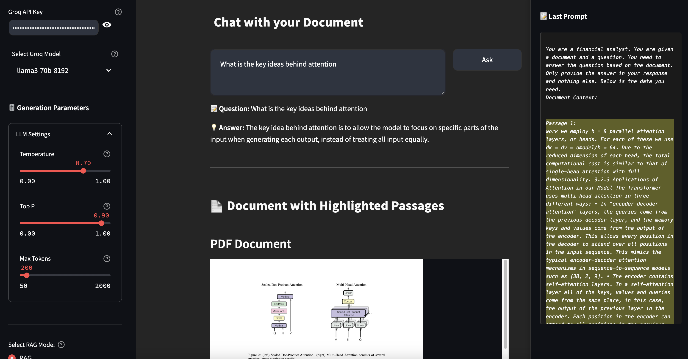

# RAG Example

A Retrieval-Augmented Generation (RAG) system for analyzing pdf documents. This system allows users to upload a pdf document and ask questions about their contents via open source LLMs available via Groq (the user needs a free API from Groq), showing you how setting up different LLM or RAG parameters influence what kind of context is retrieved for generation.

## UI Preview



## Features

- PDF document upload and processing
- Document chunking and embedding generation
- Advanced semantic search using FAISS with multiple distance metrics:
  - L2 Distance (Euclidean)
  - Dot Product
  - Cosine Similarity
  - Hamming Distance
- Multiple RAG modes:
  - Standard RAG: Direct retrieval and generation
  - Self-RAG: Enhanced retrieval with document grading and adaptive generation
- Question answering using Groq API (Llama 3, Mixtral, etc.)
- Session management for multiple documents
- Thread-safe operations
- Docker support for easy deployment
- Secure API key handling with encryption
- Comprehensive test suite (unit, integration, and functional tests)

## Installation

### Using Poetry (Recommended)

1. Clone the repository:
```bash
git clone https://github.com/pennacchietti210890/rag-example
cd rag-exapmle
```

2. Install Poetry if you don't have it already:
```bash
pip install poetry
```

3. Install dependencies using Poetry:
```bash
poetry install
```

4. Set up environment variables:
Create a `.env` file in the root directory with:
```
GROQ_API_URL=https://api.groq.com/openai/v1/chat/completions
GROQ_API_KEY=your_groq_api_key
```

### Using Docker

1. Clone the repository:
```bash
git clone https://github.com/pennacchietti210890/rag-example
cd rag-example
```

2. Build and run with Docker Compose:
```bash
docker-compose up --build
```

## Usage

### Running with Poetry

1. Start the backend server:
```bash
poetry run start-backend
```

2. Start the frontend:
```bash
poetry run start-frontend
```

3. Open your browser and navigate to `http://localhost:8501`

### Running with Docker

After running `docker-compose up --build`, open your browser and navigate to `http://localhost:8501`

## Project Structure

```
rag-example/
├── backend/
│   ├── __init__.py
│   ├── main.py                   # FastAPI backend server
│   ├── session_manager.py        # Manages user sessions
│   ├── llm/
│   │   ├── __init__.py
│   │   ├── groq.py               # Groq API integration
│   │   └── prompts/              # LLM prompt templates
│   └── rag/
│       ├── __init__.py
│       ├── rag.py                # Document processing and retrieval
│       └── self_rag/             # Self-RAG implementation
│           ├── __init__.py
│           ├── self_rag_graph.py # Workflow definition
│           ├── self_rag_nodes.py # Node implementations
│           └── rag_graders.py    # Document and generation graders
├── frontend/
│   └── app.py                    # Streamlit UI application
├── .streamlit/                   # Streamlit configuration
│   └── config.toml
├── tests/
│   ├── unit/                     # Unit tests
│   ├── functional/               # Functional tests
│   └── conftest.py               # Test fixtures
├── docker-compose.yml            # Docker Compose configuration
├── Dockerfile.backend            # Backend container definition
├── Dockerfile.frontend           # Frontend container definition
├── pyproject.toml                # Poetry project definition
├── poetry.lock                   # Poetry dependencies lock
├── requirements.txt              # pip requirements for Docker
├── .env                          # Environment variables
└── README.md                     # This documentation
```

## How It Works

### Standard RAG Flow

1. **Document Processing**: Upload a PDF document through the Streamlit interface.
2. **Chunking and Embedding**: The document is split into chunks and embedded using sentence-transformers.
3. **Query Processing**: When you ask a question, the system:
   - Finds the most relevant chunks using semantic search with your selected distance metric
   - Constructs a prompt with the relevant context
   - Sends the prompt to Groq API
   - Returns the answer

### Self-RAG Flow

Self-RAG enhances the standard RAG pipeline with additional steps:

1. **Document Retrieval**: Initial chunks are retrieved as in standard RAG.
2. **Document Grading**: Retrieved documents are evaluated for relevance to the query.
3. **Query Transformation**: The query may be transformed to improve retrieval.
4. **Adaptive Generation**: The system decides whether to generate an answer directly or to use retrieved documents.
5. **Generation Grading**: The generated answer is checked for factuality and groundedness.

## Configuration Options

### Embedding Distance Metrics

- **L2 Distance (Euclidean)**: Measures direct distance between vectors.
- **Dot Product**: Measures vector alignment; higher values indicate more similarity.
- **Cosine Similarity**: Measures angle between vectors (normalized); ideal for comparing documents of different lengths.
- **Hamming Distance**: Measures binary differences, useful for certain types of embeddings.

### RAG Parameters

- **Chunk Size**: Size of text chunks (larger chunks provide more context).
- **Chunk Overlap**: Number of overlapping tokens between chunks (higher maintains context).
- **Number of Chunks**: Number of most relevant chunks to retrieve for context.

### LLM Settings

- **Temperature**: Controls randomness (higher = more creative, lower = more deterministic).
- **Top P**: Controls diversity via nucleus sampling.
- **Max Tokens**: Maximum length of generated responses.

## Security

- User API keys are encrypted during transmission between frontend and backend
- API keys are never stored persistently
- Password field masks API key input

## License

MIT License
